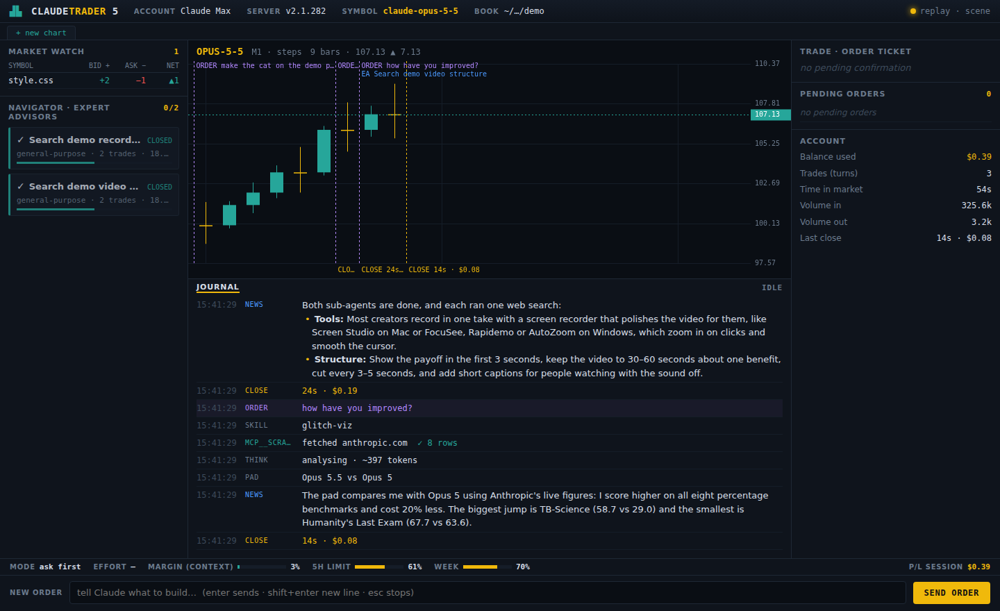
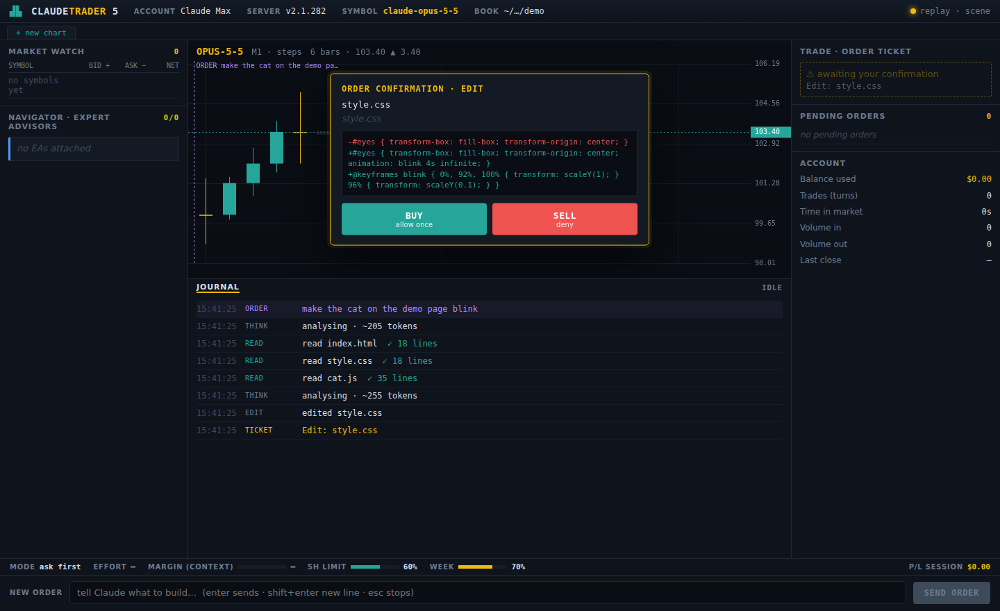

# Desk: a trading-terminal skin for Claude Code

A custom skin for [Glitch-Cat-Club/ai-coding-skins](https://github.com/Glitch-Cat-Club/ai-coding-skins).
It draws a live Claude Code session as an MT5-style trading terminal.

| Claude Code event | Shown as |
|---|---|
| Each tool step (read, edit, run) | A candle: green = worked, red = failed |
| A file edit (diff) | A big green candle, sized by lines changed |
| Thinking | A gold doji whose wicks grow with the token count |
| Your message | Purple `ORDER` line on the chart |
| Turn finished | Gold `CLOSE` line with time and cost |
| Files touched | Market Watch symbols (bid = lines added, ask = lines removed) |
| Sub-agents | Expert Advisors in the Navigator |
| Permission ask | Order ticket: **BUY** = allow once, **SELL** = deny |
| To-do list | Pending Orders |
| Cost / tokens / turns | Account panel |
| Context, 5-hour and weekly limits | Margin meters in the status bar |




## Install

Needs Claude Code (signed in) and [uv](https://docs.astral.sh/uv/).

```
git clone https://github.com/Glitch-Cat-Club/ai-coding-skins.git
cp -r desk ai-coding-skins/skins/desk
cd ai-coding-skins
uv run python run.py --folder <your project>
```

Open http://127.0.0.1:8770/skins/desk/

- Preview with no Claude session: `uv run python run.py --replay-only`, then open
  http://127.0.0.1:8770/skins/desk/?replay=scene
- Open as its own app window (Windows): `start chrome --app=http://127.0.0.1:8770/skins/desk/`

The skin runs locally only. It doesn't change claude.ai or the Claude desktop app.
